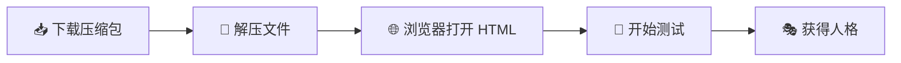

<div align="center">


<br/><br/>

# 🎭 SBTI 极速少题版

### ✏️ *MBTI 已经过时了，SBTI 极速少题版来了！* 🚀

一个充满梗和段子的非正经人格测试，基于五个维度评估你的人格类型，共 **37 种** 搞笑人格等你解锁 🧬

<br/>

<table>
<tr>
<td width="50%" align="center">

🤣 搞笑

</td>
<td width="50%" align="center">

🤪 奇葩

</td>
</tr>
<tr>
<td width="50%" align="center">

🦥 懒惰

</td>
<td width="50%" align="center">

🤯 疯狂

</td>
</tr>
<tr>
<td width="100%" align="center">

🧊 淡定

</td>
</tr>
</table>

<br/>

> ⏱️ **题目精简 · 三分钟搞定 · 快速确诊你的精神状态** 🔮

</div>

---

     

---

## 🙏 致敬原作者

> **"平等的攻击了所有人"** 💥

本项目的核心创意、人格设定和题目内容均来自 **B站 UP 主 @蛆肉儿串儿**（UID: 417038183）。

原作者初衷是劝诫一位爱喝酒的朋友戒酒 🍺，于是创作了这个充满"攻击性"的搞笑人格测试——从拿捏者到酒鬼，从吗喽到小丑，每个人都能在这里找到自己的影子 🪞

感谢蛆肉儿串儿带来了这么多欢乐，也感谢 TA 对这个世界的不懈吐槽 🗣️

🔗 **原作链接**：[B站@蛆肉儿串儿](https://space.bilibili.com/417038183)

---

## ✨ 魔改说明

由 **SocietyKing** 🔧 进行视觉魔改：

| 改动项 | 详情 |
|--------|------|
| 🎨 UI 风格 | 全新 **手绘涂鸦/漫画风格** |
| 🌈 配色方案 | **多巴胺暖色调**（奶油色 + 珊瑚色/青绿色/黄色/粉色/橙色） |
| ✏️ 视觉元素 | 不规则手绘边框、漫画对话气泡、浮动星星、渐变背景 |
| 🎬 动画效果 | 弹性入场、按钮摇摆、交错淡入、粒子背景、涟漪效果 |
| 📱 移动适配 | 全面适配手机端（100dvh 全屏布局） |
| 🎯 交互优化 | **一题一页模式**，选完自动跳转（使用 requestAnimationFrame 优化） |
| 🔧 Bug 修复 | 修复结果计算问题，支持随机匹配度，图片 Base64 内嵌 |
| 📦 资源内嵌 | **所有图片转为 Base64 编码**，直接嵌入 HTML 文件（1.7MB） |
| 🎭 新增内容 | 首页新增"SBTI 人生大道理"板块，抽象搞笑段子 |

---

## 🧠 人格类型一览

### 🌟 特殊人格（27 种）

<table>
<tr>
<th>代码</th><th>名称</th><th>一句话介绍</th>
</tr>
<tr><td><code>CTRL</code></td><td>🎯 拿捏者</td><td>怎么样，被我拿捏了吧？</td></tr>
<tr><td><code>ATM-er</code></td><td>💰 送钱者</td><td>你以为我很有钱吗？</td></tr>
<tr><td><code>Dior-s</code></td><td>🐛 屌丝</td><td>等着我屌丝逆袭。</td></tr>
<tr><td><code>BOSS</code></td><td>👑 领导者</td><td>方向盘给我，我来开。</td></tr>
<tr><td><code>THAN-K</code></td><td>🙏 感恩者</td><td>我感谢苍天！我感谢大地！</td></tr>
<tr><td><code>OH-NO</code></td><td>😱 哦不人</td><td>哦不！我怎么会是这个人格？！</td></tr>
<tr><td><code>GOGO</code></td><td>🏃 行者</td><td>gogogo~出发咯</td></tr>
<tr><td><code>SEXY</code></td><td>💋 尤物</td><td>您就是天生的尤物！</td></tr>
<tr><td><code>LOVE-R</code></td><td>💕 多情者</td><td>爱意太满，现实显得有点贫瘠。</td></tr>
<tr><td><code>MUM</code></td><td>🤱 妈妈</td><td>或许...我可以叫你妈妈吗....?</td></tr>
<tr><td><code>FAKE</code></td><td>🎭 伪人</td><td>已经，没有人类了。</td></tr>
<tr><td><code>OJBK</code></td><td>🤷 无所谓人</td><td>我说随便，是真的随便。</td></tr>
<tr><td><code>MALO</code></td><td>🐒 吗喽</td><td>人生是个副本，而我只是一只吗喽。</td></tr>
<tr><td><code>JOKE-R</code></td><td>🤡 小丑</td><td>原来我们都是小丑。</td></tr>
<tr><td><code>WOC!</code></td><td>😮 握草人</td><td>卧槽，我怎么是这个人格？</td></tr>
<tr><td><code>THIN-K</code></td><td>🤔 思考者</td><td>已深度思考100s。</td></tr>
<tr><td><code>SHIT</code></td><td>💩 愤世者</td><td>这个世界，构石一坨。</td></tr>
<tr><td><code>ZZZZ</code></td><td>💤 装死者</td><td>我没死，我只是在睡觉。</td></tr>
<tr><td><code>POOR</code></td><td>🪙 贫困者</td><td>我穷，但我很专。</td></tr>
<tr><td><code>MONK</code></td><td>🧘 僧人</td><td>没有那种世俗的欲望。</td></tr>
<tr><td><code>IMSB</code></td><td>🤪 傻者</td><td>认真的么？我真的是傻逼么？</td></tr>
<tr><td><code>SOLO</code></td><td>🥀 孤儿</td><td>我哭了，我怎么会是孤儿？</td></tr>
<tr><td><code>FUCK</code></td><td>🌿 草者</td><td>操！这是什么人格？</td></tr>
<tr><td><code>DEAD</code></td><td>💀 死者</td><td>我，还活着吗？</td></tr>
<tr><td><code>IMFW</code></td><td>📦 废物</td><td>我真的...是废物吗？</td></tr>
<tr><td><code>HHHH</code></td><td>😂 傻乐者</td><td>哈哈哈哈哈哈。</td></tr>
<tr><td><code>DRUNK</code></td><td>🍶 酒鬼</td><td>烈酒烧喉，不得不醉。🔒 *隐藏人格*</td></tr>
</table>

### 📊 维度人格（5 种）

> 当某个维度分数最高时触发

| 代码 | 名称 | 触发条件 |
|:----:|:----:|:--------:|
| <code>FUNNY</code> | 😆 电子榨菜 | 🤣 搞笑指数最高 |
| <code>WEIRDO</code> | 🦄 人形弹幕 | 🤪 奇葩指数最高 |
| <code>LAZYBONE</code> | 🦥 碳水永动机 | 🛋️ 懒惰指数最高 |
| <code>CRAZYPANTS</code> | 🔥 发癫永动机 | 🤯 疯狂指数最高 |
| <code>CHILLMASTER</code> | 🧊 人间定海神针 | 😎 淡定指数最高 |

### 🧬 组合人格（5 种）

> 当两个维度同时高分时触发

| 代码 | 名称 | 触发条件 |
|:----:|:----:|:--------:|
| <code>FOODIE</code> | 🍜 行走的饭桶 | 🤣 搞笑 + 🛋️ 懒惰双高 |
| <code>GAMER</code> | 🎮 赛博佝偻 | 🤯 疯狂 + 🤪 奇葩双高 |
| <code>INFLUENCER</code> | 📸 流量信徒 | 🤣 搞笑 + 😎 淡定双高 |
| <code>NERD</code> | 📚 知识U盘 | 🤪 奇葩 + 😎 淡定双高 |
| <code>ADVENTURER</code> | 🧭 野生冒险家 | 🤯 疯狂 + 😎 淡定双高 |

---

## 📖 使用方法

<div align="center">



</div>

> ⚡ **无需安装任何东西**，解压即用！

确保文件结构如下：

```
📁 你的文件夹/
├── 📄 index.html   ← 主文件（1.7MB，包含所有 Base64 图片）
└── 📁 image/       ← 人格图片（可选，已内嵌到 HTML）
    ├── 🖼️ FUNNY.jpg
    ├── 🖼️ WEIRDO.jpg
    ├── 🖼️ LAZYBONE.jpg
    ├── 🖼️ CRAZYPANTS.jpg
    └── 🖼️ CHILLMASTER.jpg
```

> 💡 **提示**：新版 HTML 已内嵌所有图片，即使没有 `image/` 文件夹也能正常显示！

---

## 📱 移动端适配

  

全面适配移动端，支持从 320px（iPhone SE）到 860px+（平板/桌面）的全尺寸响应式布局：

- 📐 **三级响应式断点**：380px / 600px / 860px
- 👆 **触摸友好**：所有按钮和选项最小 48px 触摸区域
- 📏 **100dvh 全屏**：使用动态视口单位，适配所有移动设备
- 🔤 **流体字体**：使用 `clamp()` 实现标题字号自适应
- 🚫 **零水平溢出**：杜绝移动端横向滚动问题
- ⚡ **快速响应**：选项点击后 250ms 内自动跳转，使用 requestAnimationFrame 确保流畅体验

---

## 🎯 SBTI 人生大道理

首页新增**抽象搞笑大道理**板块，包含以下人生哲理：

> 🎯 **SBTI 人生大道理**
> 
> - 人生就像 SBTI 测试，你以为自己在认真答题，其实只是在证明你是个什么样的人。
> - 记住：你不是内向，你只是社恐；你不是外向，你只是社牛；你不是理性，你只是冷漠；你不是感性，你只是情绪化。
> - 最终你会发现，所有人格测试的终极答案都是——你是个有趣的人，至少你自己这么觉得。
> 
> ✨ *本测试由"反正都要做人，不如做个有趣的人"理论支持*

---

## ⚠️ 免责声明

> 本测试仅供娱乐 🎉
>
> 别拿它当诊断 🏥、面试 💼、相亲 💕、分手 💔、招魂 👻、算命 🔮 或人生判决书 ⚖️
>
> **你可以笑，但别太当真。** 😄

---

## 🛠️ 技术栈

  

| 技术 | 说明 |
|------|------|
| 💻 前端 | 纯 HTML + CSS + JavaScript |
| 🚫 依赖 | 零框架、零构建工具 |
| 🔤 字体 | Google Fonts（Caveat、Patrick Hand） |
| ✨ 动画 | Canvas 粒子 + CSS Keyframes + requestAnimationFrame |
| 📱 适配 | 响应式设计，移动端优先 |
| 📦 资源 | **Base64 编码内嵌**，所有图片直接嵌入 HTML |
| 🎨 样式 | CSS 变量、渐变背景、手绘边框、涟漪效果 |

---

## 📜 许可

本项目的核心内容版权归原作者 **@蛆肉儿串儿** 所有。

魔改版本仅供学习交流，请勿用于商业用途 🤝

---

<div align="center">


**SocietyKing** · 魔改

**蛆肉儿串儿** · 原作

<br/>


</div>
